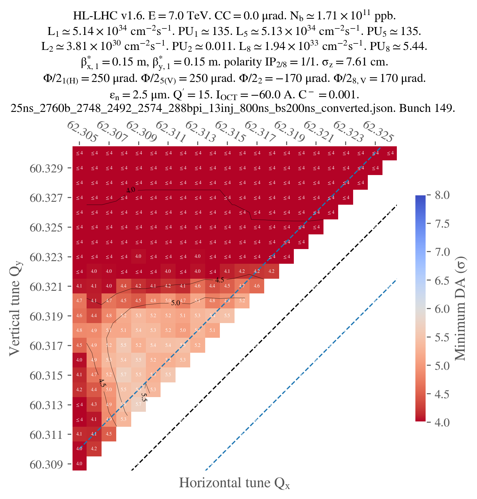

# Doing a tune scan

Tune scans are usually done in two generations: the first one allows to convert the Mad sequence to a Xsuite collider (single job), while the second one enables to configure the collider and do the tracking (scan, since many tunes are tested). Let's give an example with the ```config_hllhc16.yaml``` configuration template.

## Study configuration

First, let's configure our scan:

```yaml title="config_scan.yaml"
# ==================================================================================================
# --- Structure of the study ---
# ==================================================================================================
name: example_tune_scan

# List all useful files that will be used by executable in generations below
# These files are placed at the root of the study
dependencies:
  main_configuration: config_hllhc16.yaml

structure:
  # First generation is always at the root of the study
  # such that config_hllhc16.yaml is accessible as ../config_hllhc16.yaml
  generation_1:
    executable: generation_1.py
    common_parameters:
      # Needs to be redeclared as it's used for parallelization
      # And re-used ine the second generation
      n_split: 5

  # Second generation depends on the config from the first generation
  generation_2:
    executable: generation_2_level_by_nb.py
    scans:
      distribution_file:
        # Number of paths is set by n_split in the main config
        path_list: ["____.parquet", n_split]
      qx:
        subvariables: [lhcb1, lhcb2]
        linspace: [62.305, 62.330, 26]
      qy:
        subvariables: [lhcb1, lhcb2]
        linspace: [60.305, 60.330, 26]
        condition: qy >= qx - 2 + 0.0039
```

Here, ```generation_1.py``` and ```generation_2_level_by_nb.py``` are the same template scripts as in the [1_simple_collider.md](1_simple_collider.md) case study. The only difference is that the second generation will now be mutated in each job of generation 2 to scan the tunes.

If no specific keyword is provided, it's the cartesian product of all the variables that will be scanned. In this case, since we added a condition on the tunes (because we're only interest in the working points above the super-diagonal), the scan will be done on the tune combinations that satisfy the condition.


## Study generation

We can now write the script to generate the study:

```py title="tune_scan.py"
# ==================================================================================================
# --- Imports
# ==================================================================================================

# Import standard library modules
import os

# Import user-defined modules
from study_da import create
from study_da.utils import write_dic_to_path, load_template_configuration_as_dic

# ==================================================================================================
# --- Script to generate a study
# ==================================================================================================

# Load the template configuration 
name_template_config = "config_hllhc16.yaml"
config, ryaml = load_template_configuration_as_dic(name_template_config)

# Update the location of acc-models since it's dumped in a different folder
config["config_mad"]["links"]["acc-models-lhc"] = "path/to/acc-models-lhc"

# Drop the configuration locally
write_dic_to_path(config, name_template_config, ryaml)

# Now generate the study in the local directory
path_tree, name_main_config = create(path_config_scan="config_scan.yaml")

# Delete the configuration
os.remove(name_template_config)
```

As you can see, we load the template configuration from the package, update the location of the ```acc-models-lhc``` link (since it's dumped in a different folder), and then drop the configuration locally. We then generate the study in the local directory, and delete the configuration.

!!! note "How you modify the configuration is up to you "
    
    We could also have used the configuration file of our liking, that we can for instance place in the study directory (but that's not even needed). In this case, no need to load it as a dict and modify it in a Python script, we can just modify the `yaml` file and provide the corresponding path in the ```create``` function.

Anyway, at this point, the directory with all the jobs should be created, along with the corresponding tree file.

## Study submission

We can now submit the jobs. Ideally, we would like to submit the first generation as a local job (since there's only one job, no need to queue on a cluster), and the second generation on a cluster. However, contrarily to the [previous example](1_simple_collider.md), we're going to be lazy this time and not configure in advance the submission of the jobs. Therefore, ```study-da``` will ask you how you want to submit the jobs when you try to submit them. This is all in the following script (continuing from the previous one):

```py title="tune_scan.py"
# ==================================================================================================
# --- Script to submit the study
# ==================================================================================================

# In case gen_1 is submitted locally
dic_additional_commands_per_gen = {
    # To clean up the folder after the first generation if submitted locally
    1: "rm -rf final_* modules optics_repository optics_toolkit tools tracking_tools temp mad_collider.log __pycache__ twiss* errors fc* optics_orbit_at* \n"
    # To copy back the particles folder from the first generation if submitted to HTC
    # "cp -r particles $path_job/particles \n",
}

# Dependencies for the executable of each generation. Only needed if one uses HTC or Slurm.
dic_dependencies_per_gen = {
    1: ["acc-models-lhc"],
    2: ["path_collider_file_for_configuration_as_input", "path_distribution_folder_input"],
}

# Dic copy_back_per_gen (only matters for HTC)
dic_copy_back_per_gen = {
    1: {"parquet": True, "yaml": True, "txt": True, "json": True, "zip": True},
    2: {"parquet": True, "yaml": True, "txt": True, "json": False, "zip": False},
}

# Submit the study
submit(
    path_tree=path_tree,
    path_python_environment="/afs/cern.ch/work/u/user/private/study-DA/.venv",
    path_python_environment_container="/usr/local/DA_study/miniforge_docker",
    path_container_image="/cvmfs/unpacked.cern.ch/gitlab-registry.cern.ch/cdroin/da-study-docker:ad541f20",
    dic_dependencies_per_gen=dic_dependencies_per_gen,
    name_config=name_main_config,
    dic_additional_commands_per_gen=dic_additional_commands_per_gen,
    dic_copy_back_per_gen=dic_copy_back_per_gen,
)
```

In this script, the ```dic_additional_commands_per_gen``` is used to clean up the folder after the first generation (since we're going to submit it locally), but it could also have been use to copy back the particles folder from the first generation if we were to submit to HTC. This is needed since HTC generations run indendently from each other, and the second generation doesn't have access to the files generated by the first generation.

The ```dic_dependencies_per_gen``` is only needed if one uses HTC, and basically specifies which path should be mutated to be absolute in the configuration file of the executable, so that the executable can find the files it needs even if it's being run from a distant node.

The ```dic_copy_back_per_gen``` is also only needed for HTC, and specifies which types files should be copied back to the local folder after the job is done (independently of whatever command has been inserted into the ```dic_additional_commands_per_gen```, which just provides you with more freedom and, in this case, could have been needed for the particles forlder here since the ```dic_copy_back_per_gen``` doesn't handle folders).

Finally, note that we must provide the paths to not only the local python environment (since we're submitting the first generation locally), but also to the container image (to pull the image from the registry) and the python environment in the container. This is because, in this example, we will decide to submit the second generation to HTC with Docker.

Also note that in this case, we didn't specify ```keep_submit_until_done=True``` in the ```submit``` function, so the script will only submit one batch (most likely, generation) of jobs and stop running. However, you can run the script several times with no consequences: jobs that are already finished, or currently running or queuing, will not be resubmitted. When the study is finished, the script simply tells you (and warns you if some jobs were problematic).

## Study post-processing and plotting

The following script shoud allow you to post-process the study (gather all the output data from each individual job) and plot the results. You might want to work in a Jupyter notebook from now on, since you will probably have to play with the parameters of the plot to get the best visualization:

```py title="postprocess_and_plot.py"
# ==================================================================================================
# --- Imports
# ==================================================================================================
from study_da.plot import get_title_from_configuration, plot_heatmap
from study_da.postprocess import aggregate_output_data

# ==================================================================================================
# --- Postprocess the study
# ==================================================================================================

df_final = aggregate_output_data(
    "example_tune_scan/tree.yaml",
    l_group_by_parameters=["qx_b1", "qy_b1"],
    generation_of_interest=2,
    name_output="output_particles.parquet",
    write_output=True,
    only_keep_lost_particles=True,
)

# ==================================================================================================
# --- Plot
# ==================================================================================================

title = get_title_from_configuration(
    df_final,
    betx_value=0.15,
    bety_value=0.15,
    display_LHC_version=True,
    display_energy=True,
    display_bunch_index=True,
    display_CC_crossing=True,
    display_bunch_intensity=True,
    display_beta=True,
    display_crossing_IP_1=True,
    display_crossing_IP_2=True,
    display_crossing_IP_5=True,
    display_crossing_IP_8=True,
    display_bunch_length=True,
    display_polarity_IP_2_8=True,
    display_emittance=True,
    display_chromaticity=True,
    display_octupole_intensity=True,
    display_coupling=True,
    display_filling_scheme=True,
    display_tune=False,
    display_luminosity_1=True,
    display_luminosity_2=True,
    display_luminosity_5=True,
    display_luminosity_8=True,
    display_PU_1=True,
    display_PU_2=True,
    display_PU_5=True,
    display_PU_8=True,
)

fig, ax = plot_heatmap(
    df_final,
    horizontal_variable="qx_b1",
    vertical_variable="qy_b1",
    color_variable="normalized amplitude in xy-plane",
    plot_contours=True,
    xlabel=r"Horizontal tune $Q_x$",
    ylabel=r"Vertical tune $Q_y$",
    mask_lower_triangle=True,
    symmetric_missing = True,
    title=title,
    vmin=4,
    vmax=8,
    green_contour=6.0,
    label_cbar="Minimum DA (" + r"$\sigma$" + ")",
    output_path="output.png",
    vectorize=False,
    fill_missing_value_with="interpolate",
)
```

Basically, the ```aggregate_output_data``` function will gather all the output data from each individual job of the second generation. You have to provide it yourself the parameters that you are scanning (```qx_b1``` and ```qy_b1``` in this case), and the name of the output file that you want check for each individual jobs (if you didn't touch the configuration, it should be ```output_particles.parquet```) of the generation that you are interested in (2 in this case).

```write_output``` tells the function if it should write the aggregated data to a file (```da.parquet```  by default). It is useful since aggregating the data can be quite long, and you might want to save it for later.

Finally,  ```only_keep_lost_particles``` tells the function if it should only keep the data from lost particles (if you're only interested in the DA, for example); this is useful since the output data can be quite large.

From here, you will have to customize the title of the plot to your liking. I won't detail every single parameters as there are many, but they should be quite explicit.

!!! warning "Beta function values must be specified manually"
    
    Beta functions are not stored in the output data, so you should remember to specify them manually. In this case, I used 0.15 for both horizontal and vertical beta functions.

Finally, you can plot the result, with, again, many possibilities for customization. I only used the parameters that I thought were the most important, but you can find more in the documentation of the ```plot_heatmap``` function.

Note that, since we only ran jobs on the super-diagonal, we have to mask the lower triangle of the heatmap and set ```symmetric_missing``` to True (for proper smoothing). Also note that, in this case, one job didn't work for some reason, so I had to fill the missing value with an interpolation. This is why I used the ```fill_missing_value_with="interpolate"``` parameter.

Just for illustration, here's the final plot that I obtained:


